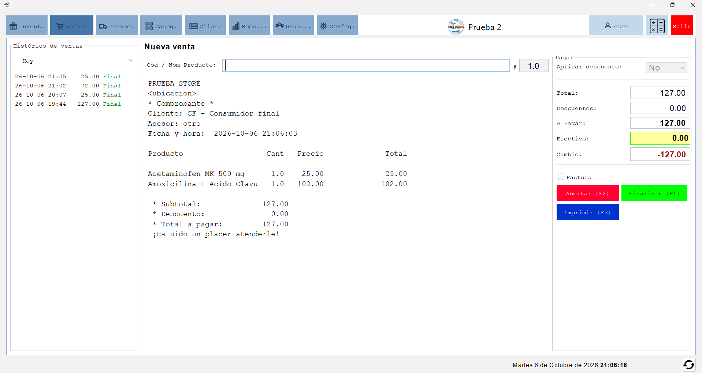
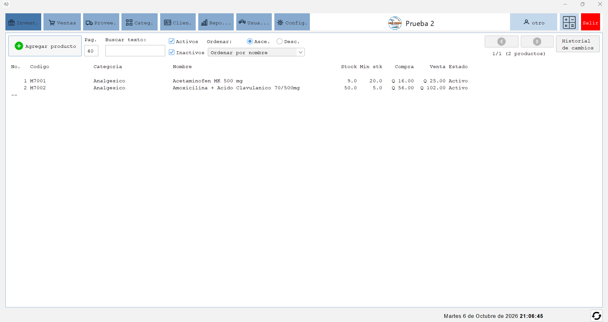

# MiniStore Desktop

MiniStore Desktop es una aplicación de escritorio para la administración de tiendas pequeñas. Esta diseñada con un estilo simple y lijero, enfocado en las funciones básicas para la administración de tiendas pequeñas.

La aplicación incluye:

- Registro y administración de ventas.
- Control de productos e inventario, incluido el historial de cambios.
- Administración de categorías, proveedores y clientes.
- Gestión de usuarios con perfiles de administrador y vendedor.
- Reportes con exportación a CSV.
- Configuración del negocio, facturas, moneda y métodos de pago.
- Soporte para SQLite, PostgreSQL, MySQL, SQL Server y Oracle.

Descargar e instalar binarios:

  1. Descargar el archivo comprimido: [MinistoreDesktop-1-0.zip](packaged/MinistoreDesktop-1-0.zip)
  2. Descomprimir en cualquier ruta y ejecutar el archivo MiniStoreDesktop.bat (Para Windows)
  NOTA: La PC debe tener instalado Java 17 o superior

Capturas:
--




## Prerrequisitos

- **JDK 17 o superior**. El proyecto se compila para Java 17.
- **Apache Maven 3.8 o superior**.
- Un entorno de escritorio con interfaz gráfica.
- Opcionalmente, **Apache NetBeans** para abrir y ejecutar el proyecto desde el IDE.

Compruebe la instalación de Java y Maven:

```bash
java -version
mvn -version
```

Para usar SQLite no es necesario instalar un servidor de base de datos. Para PostgreSQL, MySQL, SQL Server u Oracle se necesita:

- Un servidor accesible desde el equipo donde se ejecutará la aplicación.
- Una base de datos vacía.
- Un usuario con permisos para conectarse y crear tablas.

Los controladores JDBC de todos los motores soportados se descargan automáticamente como dependencias de Maven.


## Construcción

Desde la raíz del proyecto, ejecute:

```bash
mvn clean package
```

Maven generará:

- `target/MinistoreDesktop-1.0-SNAPSHOT.jar`: archivo ejecutable de la aplicación.
- `target/lib/`: dependencias necesarias durante la ejecución.

Para compilar sin borrar previamente `target/`:

```bash
mvn package
```

## Ejecución

Ejecute los comandos desde la raíz del proyecto. Esto es importante porque la aplicación carga desde `res/` los archivos de configuración, esquemas SQL y reportes.

### Mediante Java

Después de construir el proyecto:

```bash
java -jar target/MinistoreDesktop-1.0-SNAPSHOT.jar
```

### En Windows

También puede ejecutar:

```bat
MiniStoreDesktop.bat
```

El script utiliza el comando `java` disponible en `PATH`. Si Java no está configurado globalmente, edite la variable `JAVA_EXEC` del archivo y coloque la ruta al ejecutable.

### Desde NetBeans

1. Seleccione **File > Open Project** y abra esta carpeta.
2. Verifique que el proyecto use un JDK 17 o superior.
3. Ejecute **Clean and Build Project**.
4. Ejecute **Run Project**.

La clase principal es:

```text
com.lasopro.ministore.desktop.MinistoreDesktop
```

## Configuración inicial

En la primera ejecución se abrirá un asistente con los siguientes pasos:

1. Seleccionar una base de datos local SQLite o configurar una conexión remota.
2. Probar la conexión y crear el esquema de tablas.
3. Definir el nombre de la aplicación, el logo y el encabezado de factura.
4. Crear el primer usuario con perfil de administrador.

Si se selecciona SQLite, la base de datos se crea en `data/<nombre>.db`. La configuración local de conexión se guarda en `res/db.properties`. Ambos elementos están excluidos del control de versiones.

Para iniciar nuevamente el asistente en un entorno de desarrollo, cierre la aplicación y elimine `res/db.properties`. Si también desea empezar con una base SQLite vacía, elimine el archivo correspondiente dentro de `data/`.

## Estructura principal

```text
.
├── pom.xml                 Configuración de Maven
├── MiniStoreDesktop.bat    Script de ejecución para Windows
├── res/                    Configuración y scripts SQL por motor
├── data/                   Bases de datos SQLite locales
└── src/main/java/          Código fuente Java
```

## Motores de base de datos

El asistente incluye ejemplos de URL JDBC para los motores remotos:

```text
PostgreSQL: jdbc:postgresql://localhost:5432/ministore
MySQL:      jdbc:mysql://localhost:3306/ministore?useSSL=false&serverTimezone=UTC
SQL Server: jdbc:sqlserver://localhost:1433;databaseName=ministore;encrypt=true;trustServerCertificate=true
Oracle:     jdbc:oracle:thin:@localhost:1521/FREEPDB1
```

Los esquemas y consultas específicas de cada motor se encuentran en `res/`.

## Archivos locales

- `res/db.properties`: conexión seleccionada durante la configuración inicial.
- `data/`: archivos de bases de datos SQLite.
- `app.log`: registro de eventos y errores.

Estos archivos pueden contener información local o sensible y no deben agregarse al repositorio.
